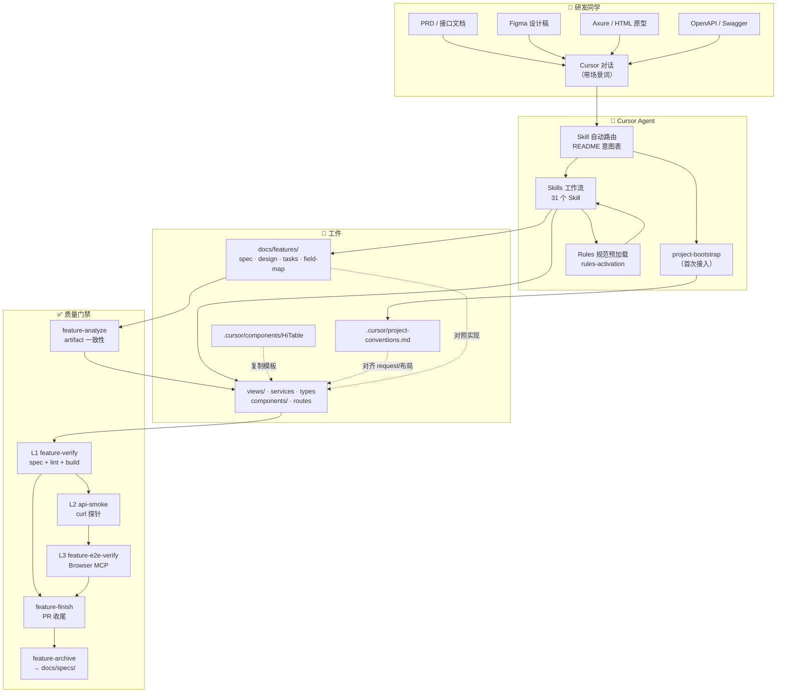
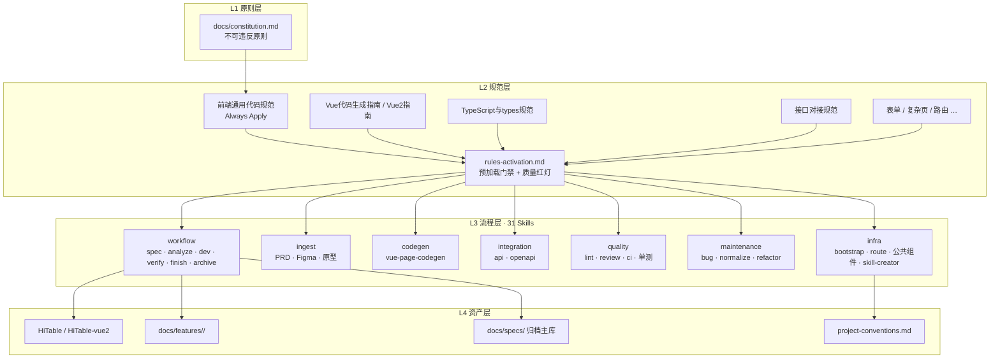
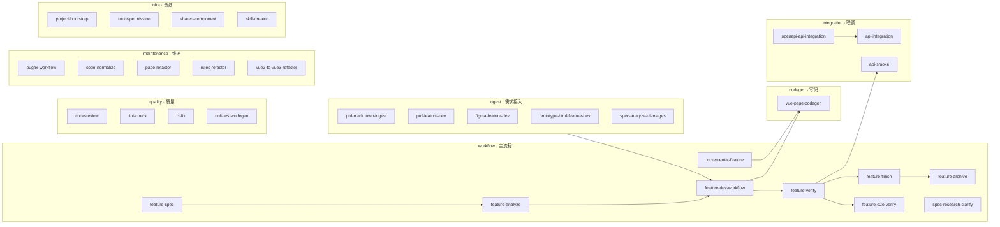
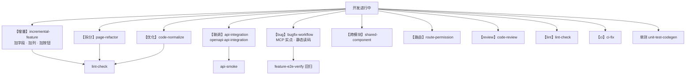
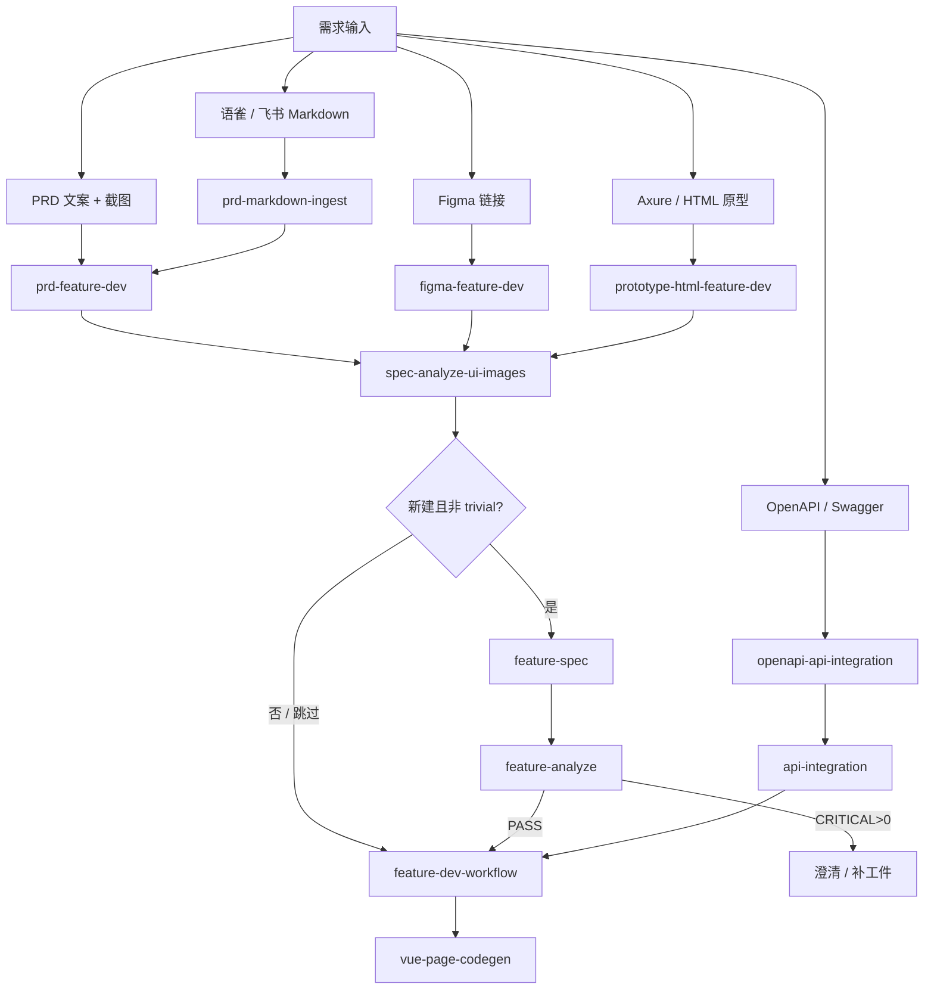
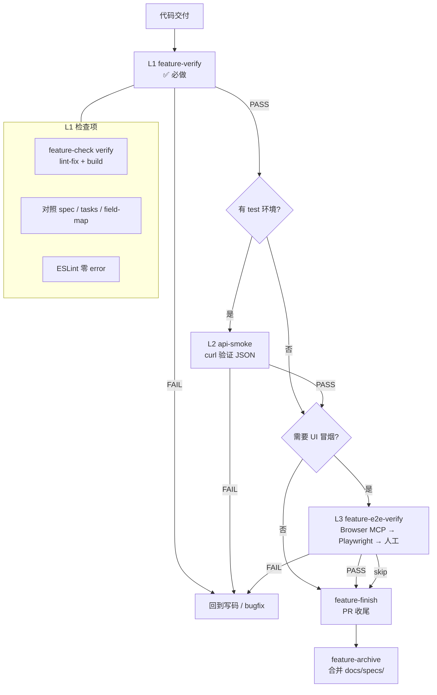
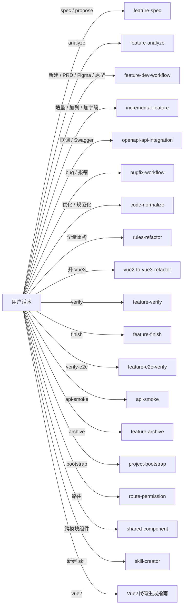
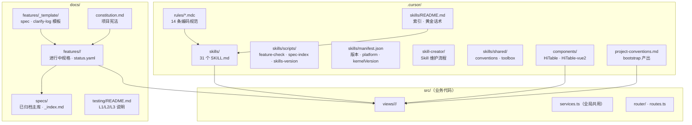

# Agent 中后台 Vue 开发工作流

> **适用对象：** 前端开发、Tech Lead、AI 辅助编码的同学  
> **技术栈：** Vue 3（主路径）+ Vue 2（兼容）+ Element Plus/UI + TypeScript  
> **配置版本：** Skills Bundle **1.3.3**（**31** 个 Skill + 14 条 Rules）  
> **文档目的：** 介绍这套 Agent 工作流「是什么、能做什么、怎么用、流程怎么走」  

---

## 目录

1. [一句话介绍](#1-一句话介绍)
2. [为什么需要这套体系](#2-为什么需要这套体系)
3. [整体架构](#3-整体架构)
4. [核心能力清单](#4-核心能力清单)
5. [完整工作流](#5-完整工作流)
6. [怎么使用：黄金话术](#6-怎么使用黄金话术)
7. [典型场景演示](#7-典型场景演示)
8. [验收体系（L1/L2/L3）](#8-验收体系l1l2l3)
9. [质量保障机制](#9-质量保障机制)
10. [最佳实践与技巧](#10-最佳实践与技巧)
11. [能力边界与不足](#11-能力边界与不足)
12. [跨 Host 使用（Claude Code / Codex）](#12-跨-host-使用claude-code--codex)
13. [Demo 建议](#13-demo-建议)
14. [FAQ](#14-faq)
15. [附录：Skill 速查表](#15-附录skill-速查表)

---

## 1. 一句话介绍

这是一套为 **中后台 Vue 项目** 定制的 **Agent 工作流配置**（**Authoring 在 Cursor**；可 **export** 到 Claude Code / Codex），通过 **Rules（怎么写对）+ Skills（什么时候做什么）+ SDD 文档（写什么、怎么验收）** 三层协作，让 AI 能按团队规范 **从需求到代码到验收** 完成标准 CRUD 页面开发、增量改页、接口联调、Bug 修复和代码规范化，避免代码写乱、返工多、协作难的问题。

---

## 2. 为什么需要这套体系

### 2.1 裸用 AI 写代码的常见问题


| 问题         | 表现                                 |
| ---------- | ---------------------------------- |
| 风格不一致      | 每次生成的目录结构、命名、写法都不同                 |
| 乱猜字段       | 接口入参兜底、出参 normalize，联调时对不上         |
| 需求只在聊天里    | 聊完就丢，无法追溯、无法验收                     |
| 整页重写       | 「加个字段」却重写整个页面                      |
| Vue 2/3 混用 | script setup 和 Options API 出现在同一项目 |
| 无法验证       | 写完不知道对不对，靠人工肉眼 review              |


### 2.2 这套体系解决什么

```
需求输入（PRD/Figma/原型/接口）
        ↓
   SDD 规格文档（可追溯）
        ↓
   规范预加载（Rules 门禁）
        ↓
   按 Skill 流程写码（可控）
        ↓
   分层验收（L1/L2/L3）
        ↓
   归档到 specs 主库（可复用）
```

**核心价值：**

- **可预期** — 同样说「新建列表页」，产出结构一致
- **可追溯** — 需求、设计、任务、字段映射都有文档
- **可验收** — 不是「AI 说写完了」，而是对照 checklist 和 spec 验证
- **可迭代** — 增量改页、联调、修 Bug 有独立路径，不互相干扰

---

## 2.5 统一权威仓（fe-agent-workflow）

PC 中后台工作流的**权威源**在 monorepo `fe-agent-workflow/pc/`，不是业务仓库 `HiStore-store-pc/.cursor/`。

| | 权威源 | 业务项目 |
|--|--------|----------|
| 改 rules/skills | `fe-agent-workflow/pc/` | `install.sh` 安装后的 `.cursor/` |
| project-conventions | 不存放 | bootstrap 生成，install **保留** |
| 进行中 feature | 仅模板 | `docs/features/<slug>/` 在业务仓 |

```bash
# 在 fe-agent-workflow 根目录
./tools/install.sh pc /path/to/HiStore-store-pc
./tools/install.sh pc /path/to/HiStore-store-pc --with-docs
```

与 uni-app 端的内核同步、版本字段、维护 FAQ：**[统一仓培训文档](../../docs/agent-workflow-repo-guide.md)**。

---

## 3. 整体架构

### 3.1 四层能力模型

```
┌─────────────────────────────────────────────────────────┐
│  L1 原则层    docs/constitution.md                       │
│              （不可违反：先 spec 后代码、禁止 mock 等）     │
├─────────────────────────────────────────────────────────┤
│  L2 规范层    .cursor/rules/*.mdc（14 条）               │
│              （Vue 写法、目录结构、接口对接、types 等）    │
│              + rules-activation.md（预加载门禁）          │
├─────────────────────────────────────────────────────────┤
│  L3 流程层    .cursor/skills/（31 个 Skill）             │
│              （新建、增量、联调、Bug、重构、验收…）        │
├─────────────────────────────────────────────────────────┤
│  L4 资产层    HiTable 模板 / feature 规格 / 项目约定      │
└─────────────────────────────────────────────────────────┘
```

### 3.2 端到端总览（人机协作）

> 一张图讲清「人 → Agent → 工件 → 验收 → 归档」全链路。




**读图要点：**


| 区域               | 含义                                                 |
| ---------------- | -------------------------------------------------- |
| **研发同学**         | 提供需求材料 + 在 Cursor 里用「场景词」发起对话                      |
| **Cursor Agent** | 自动路由 Skill → 预加载 Rules → 按工作流执行                    |
| **工件**           | 规格文档（可追溯）+ 业务代码 + 项目约定 + 页面模板                      |
| **质量门禁**         | analyze → L1 必做 → finish 合码前 → archive；L2/L3 按环境可选 |


---

### 3.3 四层架构协作关系

> Rules / Skills / SDD 文档各自管什么、谁约束谁。




---

### 3.4 Skills 分类全景（31 个）

> 按「干什么」分类了解，不必关注各个skills文件名。




---

### 3.5 新建功能主流程（SDD 全链路）

```mermaid
flowchart LR
  subgraph phase0 ["⓪ 提案"]
    S0["feature-spec"]
    Doc["proposal · spec<br/>design · tasks<br/>field-map · e2e"]
  end

  subgraph phase0b ["⓪b 分析"]
    S0b["feature-analyze"]
    Ready["CRITICAL=0<br/>方可 implement"]
  end

  subgraph phase1 ["① 理解"]
    S1["读 feature 工件"]
    PB1["project-bootstrap<br/>（首次）"]
    Ingest["PRD / Figma / 原型<br/>ingest Skills"]
  end

  subgraph phase2 ["② 对齐"]
    Plan["输出预加载计划"]
    Align["确认 path · 接口 · 文件清单"]
  end

  subgraph phase3 ["③ 写码"]
    RA["rules-activation"]
    VPC["vue-page-codegen"]
    RP["route-permission"]
    Out["views/ + services<br/>+ types + components"]
  end

  subgraph phase4 ["④ 验收"]
    RC["reference-checklist"]
    FV["feature-verify L1"]
    ASM["api-smoke L2"]
    E2E["feature-e2e-verify L3"]
  end

  subgraph phase5 ["⑤ 收尾"]
    FF["feature-finish<br/>PR 描述 + 自检"]
    Arch["feature-archive"]
  end

  S0 --> Doc
  Doc --> S0b
  S0b --> Ready
  Ready --> S1
  PB1 --> S1
  Ingest --> S1
  S1 --> Plan
  Plan --> Align
  Align --> RA
  RA --> VPC
  VPC --> Out
  Out --> RP
  RP --> RC
  RC --> FV
  FV --> ASM
  ASM --> E2E
  FV --> FF
  E2E --> FF
  FF --> Arch
```




> **快捷路径：** trivial 单页可跳过 ⓪，直接从 ① 进入；用户说「直接写码」即可。  
> **写码前门禁：** 非 trivial 新建须在 ⓪b `feature-analyze` PASS（`CRITICAL=0`）后再 implement。

---

### 3.6 开发过程中的并行路径

> 强调「新建」不是唯一入口，日常开发大量走增量/联调/Bug。




---

### 3.7 需求输入 → Skill 分流




**UI 结构来源优先级：** Figma > 原型 HTML > PRD 截图/文案  
**业务规则与接口权威：** PRD / 接口文档 > 设计稿 label

---

### 3.8 质量门禁流水线




| 层级     | 验证什么          | 抓 AI 哪类问题     |
| ------ | ------------- | ------------- |
| **L1** | 需求是否写进代码、能否编译 | 漏字段、目录错、未使用引入 |
| **L2** | 真实接口 JSON 形状  | URL/分页/嵌套解包错  |
| **L3** | 浏览器内主流程可点     | 路由、交互、UI 绑定错  |


---

### 3.9 各层职责


| 层级       | 文件位置                             | 回答的问题                    |
| -------- | -------------------------------- | ------------------------ |
| **原则**   | `docs/constitution.md`           | 什么绝对不能做？                 |
| **规范**   | `.cursor/rules/*.mdc`            | 代码应该怎么写？                 |
| **流程**   | `.cursor/skills/*/SKILL.md`      | 什么场景走什么步骤？               |
| **规格**   | `docs/features/<slug>/`          | 这个需求具体要什么？               |
| **项目约定** | `.cursor/project-conventions.md` | 这个项目 request 路径、布局组件是什么？ |
| **组件模板** | `.cursor/components/HiTable/`    | 列表页标准骨架在哪？               |


### 3.10 Agent 如何选用 Skill

Agent 会根据你的**意图关键词**自动路由到对应 Skill，**不需要说出skills名称**：




| 你说的话                      | Agent 选用的 Skill                               |
| ------------------------- | --------------------------------------------- |
| 「【spec】」「propose」         | `feature-spec`                                |
| 「【analyze】」「ready 前评审」    | `feature-analyze`                             |
| 「新建」「按 PRD」「按 Figma」「从零」  | `feature-dev-workflow`                        |
| 「增量」「加一个字段」「列表加一列」        | `incremental-feature`                         |
| 「联调」「对接接口」「Swagger」       | `openapi-api-integration` / `api-integration` |
| 「bug」「报错」「点击没反应」          | `bugfix-workflow`                             |
| 「优化」「按规范整理」               | `code-normalize`                              |
| 「全量重构」「所有代码按规范改」          | `rules-refactor`                              |
| 「【verify】」「验收」            | `feature-verify`                              |
| 「【finish】」「PR 收尾」         | `feature-finish`                              |
| 「【archive】」「归档」           | `feature-archive`                             |
| 「新建 skill」「skill-creator」 | `skill-creator`（**维护者**，不写业务代码）               |


> **技巧：** 首句带上场景词（`【spec】` `【analyze】` `【新建】` `【增量】` `【联调】` `【bug】` `【verify】` `【finish】`），路由准确率会显著提高。

### 3.11 配置目录与文件布局

> 「改规范改哪、写 spec 放哪、模板在哪拷」。




---

## 4. 核心能力清单

### 4.1 新功能开发


| 能力          | 说明                                      | 对应 Skill                                  |
| ----------- | --------------------------------------- | ----------------------------------------- |
| SDD 提案      | 产出 proposal/spec/design/tasks/field-map | `feature-spec`                            |
| Artifact 分析 | implement 前交叉校验工件；CRITICAL>0 禁止写码       | `feature-analyze`                         |
| PR 收尾       | verify PASS 后 PR 描述 + 自检 + archive 提示   | `feature-finish`                          |
| PRD 接入      | 语雀/飞书 Markdown、PRD 文案+截图                | `prd-markdown-ingest` / `prd-feature-dev` |
| Figma 切页    | 读设计稿生成 Vue 页面                           | `figma-feature-dev`                       |
| HTML 原型     | 本地/远程 Axure 原型转 Vue                     | `prototype-html-feature-dev`              |
| 页面代码生成      | 列表/表单/详情/弹窗/复杂页                         | `vue-page-codegen`                        |
| 路由注册        | 新页面本地 path 注册                           | `route-permission`                        |


**支持的页面类型：**


| 类型  | 特征           | Vue 3              | Vue 2        |
| --- | ------------ | ------------------ | ------------ |
| 列表页 | 筛选 + 表格 + 分页 | HiTable            | HiTable-vue2 |
| 表单页 | 多字段录入 + 提交   | 表单与详情页指南           | Vue2 指南 §表单  |
| 详情页 | 只读信息分组       | 同上                 | 同上           |
| 组合页 | 列表 + 弹窗编辑    | index + EditDialog | Options API  |
| 复杂页 | 工作台/双栏/多 Tab | hooks 拆分           | mixins 拆分    |


**标准页面目录结构（Vue 3）：**

```
views/<module>/<page-dir>/
├── index.vue           # 页面主文件
├── services.ts         # 接口
├── types.ts            # Query / Item / Form 类型
├── constants.ts        # 枚举、Tab、options（按需）
├── utils.ts            # 格式化、toXxxParams（按需）
├── hooks/              # 复杂页/表单 hook（按需）
└── components/         # 页面子组件（按需）
```

### 4.2 增量开发


| 能力     | 说明                             |
| ------ | ------------------------------ |
| 加筛选字段  | 同步改 query、types.ts、模板          |
| 加表格列   | 加 el-table-column + types Item |
| 加按钮/操作 | 加 handler + 接口（按需）             |
| 弹窗加字段  | 改 EditDialog + Form 类型         |
| 接口字段对齐 | 对照 field-map 改 services/types  |


> **原则：** 只改必要文件，禁止整页重写。

### 4.3 接口联调


| 能力           | 说明                                 | Skill                     |
| ------------ | ---------------------------------- | ------------------------- |
| OpenAPI 自动生成 | 从 Swagger spec 生成 types + services | `openapi-api-integration` |
| 手写接口对接       | 按文档写 services、对齐字段                 | `api-integration`         |
| curl 探针验证    | 发真实请求验证 JSON 结构                    | `api-smoke`               |


**核心约束（接口对接规范）：**

- 入参 **原样透传**，禁止 `|| ''` 兜底筛选条件
- 出参 **原样绑定**，禁止 `normalizeRows` 多字段猜测
- 展示空值用 `?? '-'`，不用 `||`（避免 0 被当成空）

### 4.4 质量与验收


| 层级  | 能力                     | Skill                |
| --- | ---------------------- | -------------------- |
| L1  | 对照 spec + lint + build | `feature-verify`     |
| L2  | curl 接口探针              | `api-smoke`          |
| L3  | 浏览器 P0 冒烟              | `feature-e2e-verify` |
| —   | ESLint 零 error         | `lint-check`         |
| —   | 规范审查（只评不改）             | `code-review`        |
| —   | 单元测试                   | `unit-test-codegen`  |


### 4.5 维护与重构


| 能力          | 说明                                     | Skill                   |
| ----------- | -------------------------------------- | ----------------------- |
| Bug 排查修复    | 四阶段（复现→假设→验证→修复）；MCP 优先，可降级静态读码        | `bugfix-workflow`       |
| 单页规范化       | 对齐 rules，不改业务行为                        | `code-normalize`        |
| 大文件拆分       | 提取 hooks/子组件                           | `page-refactor`         |
| 全项目重构       | 自主闭环至全部合规                              | `rules-refactor`        |
| Vue2 升 Vue3 | Composition API + Pinia + Element Plus | `vue2-to-vue3-refactor` |
| 跨模块组件       | 封装到顶层 components/                      | `shared-component`      |
| CI 修复       | build/test/vue-tsc 失败修复                | `ci-fix`                |


### 4.6 项目基建


| 能力         | 说明                                    | 触发时机                           |
| ---------- | ------------------------------------- | ------------------------------ |
| 项目约定扫描     | 产出 project-conventions.md + spec 索引   | **每个项目首次接入必做**                 |
| Feature 看板 | `status.yaml` + `feature-check board` | 查看进行中 feature                  |
| SDD 归档     | 合并 spec 到 docs/specs/                 | feature-verify PASS 且 finish 后 |
| 跨 Host 导出  | `export-agent-host.py` → Claude / Codex | 改 Skill/Rules 后 re-export；见 [§12](#12-跨-host-使用claude-code--codex) |
| Skill 维护   | 创建/修改/优化 Agent Skill                  | Tech Lead；走 `skill-creator`    |


### 4.7 Skill 维护（Tech Lead / 维护者）

> 对齐 [agentskills.io](https://agentskills.io/specification) 开放标准；团队版流程见 `.cursor/skills/skill-creator/`。


| 能力       | 说明                            | Skill            |
| -------- | ----------------------------- | ---------------- |
| 新建 Skill | 工作流沉淀为 SKILL.md + 登记 manifest | `skill-creator`  |
| 优化触发词    | 改 description，减少 undertrigger | `skill-creator`  |
| 规范校验     | `skills-version.py check`     | skill-creator §④ |


**典型话术：**

```
【skill-creator】帮我把「XXX 流程」沉淀成一个 Skill，category workflow
```

**与 Anthropic 官方 [skill-creator](https://github.com/anthropics/skills/tree/main/skills/skill-creator) 的关系：** 官方偏 eval/benchmark；本仓库集成 manifest、README、CHANGELOG、skill-conventions。

---

## 5. 完整工作流

### 5.1 主路径：新建功能（推荐 SDD 全链路）

```
                    ┌──────────────────────────────────┐
                    │           需求输入                │
                    │  PRD / Figma / 原型 / OpenAPI    │
                    └──────────────┬───────────────────┘
                                   ↓
              ┌────────────────────────────────────────────┐
              │  ⓪ feature-spec（新建推荐，可跳过 trivial）  │
              │  产出 docs/features/<slug>/                 │
              │  proposal · spec · design · tasks · field-map │
              └────────────────────┬───────────────────────┘
                                   ↓
              ┌────────────────────────────────────────────┐
              │  ⓪b feature-analyze（写码前门禁）            │
              │  feature-check analyze <slug>              │
              │  CRITICAL>0 → 补工件 / 澄清，禁止 implement   │
              └────────────────────┬───────────────────────┘
                                   ↓
              ┌────────────────────────────────────────────┐
              │  ① 理解需求                                  │
              │  · project-bootstrap（首次）                 │
              │  · 判定页面类型（列表/表单/详情/复杂）         │
              │  · 搜索同模块已有页面对齐写法                   │
              └────────────────────┬───────────────────────┘
                                   ↓
              ┌────────────────────────────────────────────┐
              │  ② 方案对齐                                  │
              │  · 输出预加载计划（Read 哪些 rules）           │
              │  · 确认 path、接口、文件清单                   │
              │  · 信息不足先提问，不猜测                      │
              └────────────────────┬───────────────────────┘
                                   ↓
              ┌────────────────────────────────────────────┐
              │  ③ 生成代码                                  │
              │  · rules-activation 预加载                   │
              │  · vue-page-codegen 按模板写码               │
              │  · 同步勾选 tasks.md                         │
              │  · route-permission 注册路由                 │
              └────────────────────┬───────────────────────┘
                                   ↓
              ┌────────────────────────────────────────────┐
              │  ④ 规范验收                                  │
              │  · reference-checklist                       │
              │  · feature-verify（L1 必做）                 │
              │  · api-smoke（L2 可选）                      │
              │  · feature-e2e-verify（L3 可选）             │
              └────────────────────┬───────────────────────┘
                                   ↓
              ┌────────────────────────────────────────────┐
              │  feature-finish（verify PASS 后）            │
              │  PR 描述 · 合码自检 · archive 提示           │
              └────────────────────┬───────────────────────┘
                                   ↓
              ┌────────────────────────────────────────────┐
              │  feature-archive                             │
              │  合并到 docs/specs/ 主库                      │
              └────────────────────────────────────────────┘
```

### 5.2 快捷路径：跳过 Spec 直接写码

适用于 **scope 明确、单页 trivial** 的场景（用户需显式说明）：

```
【新建】按 PRD 开发商品标签列表页。模块 product，路由 /product/tag-list。页面类型：列表页。附件：接口文档
```

Agent 会走 `feature-dev-workflow` 但跳过 ⓪ spec 阶段，直接进入 ①～④。

### 5.3 并行路径：开发过程中的常用操作

```
开发进行中
    ├── 【增量】加字段/列/按钮        → incremental-feature
    ├── 【联调】接口文档更新          → api-integration / openapi-api-integration
    ├── 【bug】报错/点击无反应        → bugfix-workflow
    ├── 【拆分】文件太大              → page-refactor
    ├── 【优化】单页规范化            → code-normalize
    ├── 【路由】注册新 path           → route-permission
    ├── 【review】提交前审查          → code-review
    ├── 【lint】ESLint 检查           → lint-check
    └── 【ci】build/test 失败         → ci-fix
```

### 5.4 首次接入项目（必做一次）

```
扫描项目约定，生成 project-conventions.md
```

**为什么必做：**

- 不同项目的 `request` import 路径不同（`@/config/request` vs `@/utils/request`）
- 分页字段名不同（`pageNo/pageSize` vs `current/size`）
- 布局组件、样式路径不同

Bootstrap 扫描后写入 `.cursor/project-conventions.md`，并刷新 `docs/specs/_index.md`（路由 ↔ spec 缺口），后续所有写码都会 Read conventions 对齐。

### 5.5 Skill 依赖关系图

```
feature-spec
    └── feature-analyze（写码前）
            └── feature-dev-workflow（主工作流）
                    ├── prd-markdown-ingest / prd-feature-dev
                    ├── figma-feature-dev
                    ├── prototype-html-feature-dev
                    ├── vue-page-codegen
                    └── feature-verify
                            ├── api-smoke（L2）
                            ├── feature-e2e-verify（L3）
                            ├── feature-finish（PR 收尾）
                            └── feature-archive

incremental-feature → vue-page-codegen
openapi-api-integration → api-integration
rules-refactor → code-normalize → lint-check
project-bootstrap → spec-index.py
```

### 5.6 feature-check CLI（本地门禁）

Agent 与研发均可直接跑（路径：`.cursor/skills/scripts/`）：

```bash
# 列出 / 看板
python3 .cursor/skills/scripts/feature-check.py list
python3 .cursor/skills/scripts/feature-check.py board

# 规格完整性（implement 前）
python3 .cursor/skills/scripts/feature-check.py spec <slug>

# artifact 一致性（analyze）
python3 .cursor/skills/scripts/feature-check.py analyze <slug>

# L1 验收（默认 lint-fix + build）
python3 .cursor/skills/scripts/feature-check.py verify <slug>
python3 .cursor/skills/scripts/feature-check.py verify <slug> --no-build   # 快检

# 归档前
python3 .cursor/skills/scripts/feature-check.py archive-ready <slug>

# 更新 status.yaml
python3 .cursor/skills/scripts/feature-check.py sync-status <slug> --set verifying

# 刷新 spec 索引
python3 .cursor/skills/scripts/spec-index.py
```

> **团队决策：** verify 默认跑 `lint-fix` + `build`；**不接入 CI**，本地 + Agent 使用。TDD strict **暂缓**（`testStrategy: pending`）。

---

## 6. 怎么使用：黄金话术

> **原则：** 首句带【场景词】+ 尽量提供结构化信息（模块、path、页面类型、附件）

### 6.1 首次接入

```
扫描项目约定，生成 project-conventions.md
```

### 6.2 新建功能（推荐先 Spec）

```
【spec】propose product-tag-list。按 PRD 开发商品标签列表，模块 product，path /product/tag-list，列表页。附件：接口文档
```

Spec 完成后，**写码前先 analyze**：

```
【analyze】product-tag-list
```

通过后开发：

```
【新建】按 docs/features/product-tag-list/ 实现商品标签列表页
```

### 6.3 新建功能（跳过 Spec 快捷路径）

```
【新建】按 PRD 开发商品标签列表页。模块 product，路由 /product/tag-list。页面类型：列表页。附件：接口文档
```

### 6.4 语雀 PRD

```
【spec】propose mini-goods-detail。语雀 PRD 如下：（粘贴 Markdown 全文）
```

### 6.5 Figma 设计稿

```
【新建】按 Figma 切页面。设计链接：https://figma.com/design/xxx ，模块 product，路由 /product/detail
```

### 6.6 Axure 原型

```
【新建】按 Axure 原型开发商品详情页。原型 http://host/小程序商城/index.html#商品详情页.html ，附接口文档
```

### 6.7 增量改页

```
【增量】在 views/product/tag-list 加「状态」筛选和表格列，接口字段 status / statusDesc
```

```
【增量】在 order/list 加一个「导出」按钮，接口 POST /order/export
```

### 6.8 接口联调

```
【联调】接口文档更新了，帮我对接 product/tag-list 列表字段，附件 swagger
```

```
【联调】按 OpenAPI 对接 order/list，spec 路径 docs/openapi/order.yaml
```

### 6.9 修 Bug

```
【bug】product/tag-list 筛选后表格不刷新，帮我排查修复
```

```
【bug】点击「保存」没反应，console 报错：xxx
```

### 6.10 规范优化

```
【优化】按规范整理 views/product/list，全量对齐 rules（types、HiTable、hooks、写法）
```

### 6.11 全项目重构

```
【重构】全项目按规范重构，Vue2 保持不变，功能不变，改完 review 循环直到全部合规，中途不要问我是否继续
```

### 6.12 Vue2 升 Vue3

```
【vue3】全项目从 Vue2 升 Vue3，功能不变，按 rules 改完并 review 到全部通过
```

### 6.13 路由注册

```
【路由】新建商品标签列表页，path /product/tag-list，待后端在「商品-基础资料」下配菜单
```

### 6.14 验收、收尾与归档

```
【verify】product-tag-list
```

```
【finish】product-tag-list
```

```
【api-smoke】product-tag-list
```

```
【verify-e2e】product-tag-list
```

```
【archive】product-tag-list
```

> **顺序：** verify PASS → finish（合码前）→ 合码上线 → archive。

### 6.15 Vue 2 项目

```
【vue2】【新建】在 order 模块新建退款列表页，Options API，Element UI
```

### 6.16 Skill 维护（维护者）

```
【skill-creator】帮我把「OpenAPI 变更 diff 联调」沉淀成 Skill，category integration
```

```
【skill-creator】优化 incremental-feature 的 description，减少和 feature-dev-workflow 误触发
```

---

## 7. 典型场景演示

### 场景 A：从零新建一个标准列表页（完整 SDD 流程）

**背景：** 产品给了 PRD + 接口文档，要做「商品标签列表页」

**Step 1 — 首次接入（若未做过）**

```
扫描项目约定，生成 project-conventions.md
```

**Step 2 — 写 Spec**

```
【spec】propose product-tag-list。按 PRD 开发商品标签列表，模块 product，path /product/tag-list，列表页。附件：接口文档
```

Agent 产出：

```
docs/features/product-tag-list/
├── proposal.md      # 背景、范围、成功标准
├── spec.md          # 用户故事、验收场景
├── design.md        # 页面结构、文件清单、接口列表
├── tasks.md         # 开发任务 checklist
├── field-map.md     # 前后端字段映射
├── e2e.md           # P0 浏览器验收路径（可选）
├── status.yaml      # workflow 状态（proposing / implementing / verifying …）
└── clarify-log.md   # 澄清记录（复杂需求，可选）
```

**Step 2.5 — Analyze（写码前）**

```
【analyze】product-tag-list
```

Agent 运行 `feature-check analyze`，输出 CRITICAL/WARNING；**CRITICAL>0 不得开始写码**。

**Step 3 — 开发**

```
【新建】按 docs/features/product-tag-list/ 实现商品标签列表页
```

Agent 产出：

```
views/product/tag-list/
├── index.vue
├── services.ts
├── types.ts
├── constants.ts
└── components/HiTable/   # 从模板复制
```

并在 `views/product/routes.ts` 注册路由。

**Step 4 — 验收**

```
【verify】product-tag-list
```

Agent 默认跑 `feature-check verify`（lint-fix + build），对照 tasks 勾选。

**Step 5 — 收尾（合码前）**

```
【finish】product-tag-list
```

Agent 产出 PR 描述、合码自检清单、archive 提示。

**Step 6 — 归档（上线后）**

```
【archive】product-tag-list
```

---

### 场景 B：已有页面加一个筛选字段（增量）

**背景：** 标签列表页已上线，产品要加「状态」筛选

```
【增量】在 views/product/tag-list 加「状态」筛选和表格列，接口字段 status / statusDesc
```

Agent 会：

1. Read 现有页面代码
2. 改 `types.ts` 加 Query.status
3. 改模板加 el-select
4. 改表格加 el-table-column
5. **不会**重写整个页面

---

### 场景 C：接口文档更新，字段对不齐

**背景：** 后端改了响应结构，列表字段名变了

```
【联调】接口文档更新了，帮我对接 product/tag-list 列表字段，附件 swagger
```

Agent 会：

1. 读 OpenAPI / 接口文档
2. 对照 `field-map.md` 和现有 `types.ts`
3. 改 services 和模板绑定
4. 可选跑 `【api-smoke】product-tag-list` 验证

---

### 场景 D：页面 Bug 排查

**背景：** 筛选后表格不刷新

```
【bug】product/tag-list 筛选后表格不刷新。操作：选状态→点查询→表格数据不变。预期：表格刷新
```

Agent 会：

1. **Phase 1 复现** — MCP 实点或用户步骤 + 预期/实际
2. **Phase 2 假设** — 列出 2～3 个可能根因
3. **Phase 3 验证** — 用证据（文件:行 / network）确认根因
4. **Phase 4 修复** — 最小 diff + lint-fix

---

### 场景 E：老页面按规范整理

**背景：** 历史页面 types 散落在 hook 里、用了 function 声明

```
【优化】按规范整理 views/product/list，全量对齐 rules
```

Agent 会：

1. 读 code-normalize checklist
2. 迁 types 到 types.ts
3. 改箭头函数
4. 对齐 HiTable 用法
5. 跑 lint-check

---

## 8. 验收体系（L1/L2/L3）

```
L3  feature-e2e-verify     浏览器 P0 冒烟（能点、能看、主流程通）
L2  api-smoke               测试环境 curl 接口探针（JSON 结构对）
L1  feature-verify          SDD + lint + build（需求写进代码、能编译）
```


| 层      | 验证什么                     | 抓 AI 哪类问题     | 环境要求                   |
| ------ | ------------------------ | ------------- | ---------------------- |
| **L1** | spec/tasks 对照、lint、build | 漏字段、目录错、未使用引入 | 本地即可                   |
| **L2** | 真实接口 JSON 形状             | URL/分页/嵌套解包错  | 需 test 环境 + token      |
| **L3** | 浏览器内主流程可点                | 路由、交互、UI 绑定错  | 需 dev 环境 + Browser MCP |


**推荐顺序：**

```
feature-analyze（写码前）→ feature-verify（L1 必做）→ feature-finish（合码前）
  → api-smoke（L2 可选）→ feature-e2e-verify（L3 可选）→ feature-archive
```

### 8.1 Clarify 分级（写 spec 时）


| 类型            | 示例                      | 处理                   |
| ------------- | ----------------------- | -------------------- |
| **Blocker**   | path、主接口 URL、模块、权限/页面冲突 | 未澄清不得标 ready         |
| **非 Blocker** | 页面类型、文案、样式、非核心字段        | 可默认 + 记录 clarify-log |


> 模板：`docs/features/_template/clarify-log.md`

> **注意：** 任一层不能单独代表「可上线」；L1 是门禁，L2/L3 按环境可选加强。

---

## 9. 质量保障机制

### 9.1 规范预加载门禁

写码前 Agent **必须 Read** 对应 rules，并汇报：

```
规范预加载：Vue 3 | 列表页 | Skill feature-dev-workflow | 已读 rules ×5 | request @/config/request
```

复杂任务还需先输出「预加载计划」：

```markdown
## 预加载计划
- 场景词：新建
- 选用 Skill：feature-dev-workflow
- 将 Read：
  1. shared/rules-activation.md
  2. Vue代码生成指南.mdc
  3. TypeScript与types规范.mdc
  4. 接口对接规范.mdc
  ...
```

### 9.2 质量红灯（出现即视为流程失败）


| 红灯                                  | 说明                   |
| ----------------------------------- | -------------------- |
| 无「规范预加载」汇报                          | 未走 rules-activation  |
| Vue 2 出现 script setup / Pinia       | 版本判错                 |
| request 路径与 project-conventions 不一致 | 未 bootstrap          |
| types 留在 hook/constants 里           | 应迁 types.ts          |
| 入参兜底 / 出参 normalize 猜测              | 违反接口对接规范             |
| 新建页无 spec 且未声明跳过                    | 应先 feature-spec      |
| analyze CRITICAL>0 仍开始写码            | 应先补工件 / 澄清           |
| 新建 feature 无 verify 报告即交付           | 阶段 ④ 未完成             |
| verify 未 PASS 即 archive             | 须 finish + verify 先过 |
| 大批量改码后未跑 lint                       | 须 ESLint 零 error     |


### 9.3 项目宪法（不可违反原则）

1. **先 spec 后代码** — 新建页须有 design.md + tasks.md
2. **路由 path ↔ 目录一致** — `/product/tag-list` → `views/product/tag-list/`
3. **接口入参原样透传** — 禁止 `|| ''` 兜底
4. **出参原样绑定** — 禁止 normalizeRows 猜测
5. **禁止 mock** — 除非用户明确要求
6. **types 就近** — 页面级 interface 只在 types.ts
7. **最小 diff** — 增量/bugfix 不借机重构无关代码

### 9.4 项目工具箱（Agent 优先使用）

确定性操作用 CLI，不手写等价流程。完整清单见 `.cursor/skills/shared/project-toolbox.md`。


| 场景           | 命令 / Skill                                  |
| ------------ | ------------------------------------------- |
| 看进行中 feature | `feature-check board`                       |
| 写码前 analyze  | `feature-check analyze <slug>`              |
| 交付验收         | `feature-check verify <slug>`               |
| 路由↔spec 缺口   | `spec-index.py`                             |
| 改码后 lint     | `npm run lint-fix`                          |
| 新建/改 Skill   | `skill-creator` + `skills-version.py check` |


---

## 10. 最佳实践与技巧

### 10.1 给 Agent 的信息越结构化越好

**❌ 模糊：**

```
帮我做一个标签页
```

**✅ 结构化：**

```
【新建】按 PRD 开发商品标签列表页（提供PRD或原型未包含信息）。
- 模块：product
- 路由：/product/tag-list
- 页面类型：列表页
- 筛选：标签名称、状态
- 表格列：标签名称、状态、创建时间、操作（编辑/删除）
- 附件：接口文档（或 swagger URL）
```

### 10.2 首句带场景词


| 场景词               | 作用               |
| ----------------- | ---------------- |
| `【spec】`          | 走 SDD 提案         |
| `【analyze】`       | 写码前 artifact 一致性 |
| `【新建】`            | 从零开发             |
| `【增量】`            | 已有页加功能           |
| `【联调】`            | 接口对接             |
| `【bug】`           | 排查修复             |
| `【优化】`            | 规范整理             |
| `【verify】`        | L1 验收            |
| `【finish】`        | PR 收尾            |
| `【skill-creator】` | 新建/改 Skill（维护者）  |
| `【vue2】`          | Vue 2 项目         |


### 10.3 附件/材料优先级


| 材料              | 权威范围               |
| --------------- | ------------------ |
| PRD / 接口文档      | 业务规则、字段含义          |
| OpenAPI/Swagger | 接口 URL、入参出参结构      |
| Figma           | UI 结构、布局、样式        |
| Axure/HTML 原型   | UI 结构（交互页需 MCP 实点） |
| 同模块已有页面         | 代码风格对齐             |


**冲突时优先级：** PRD/接口文案 > 设计稿/截图 > 推断

### 10.4 什么时候该先 Spec、什么时候可以跳过


| 先 Spec         | 可跳过 Spec               |
| -------------- | ---------------------- |
| 新建页、多文件        | 单文件小改                  |
| 多接口、复杂页        | 明确 trivial 的单页列表       |
| 团队协作、需追溯       | 用户明确「直接写码」             |
| 需 field-map 联调 | incremental-feature 场景 |


### 10.5 多人协作建议

1. **project-conventions.md 提交到仓库** — 团队共享项目约定
2. **docs/features/ 随 PR 提交** — spec 和代码一起 review
3. **feature-verify + finish 报告贴 PR** — 验收与合码自检有据可查
4. **上线后 archive** — 规格合并到 docs/specs/ 主库，并跑 spec-index

---

## 11. 能力边界与不足

### 11.1 擅长（推荐用 Agent 的场景）

- ✅ 标准 CRUD 列表页/表单页/详情页
- ✅ 已有页加字段、加列、加按钮
- ✅ 按 OpenAPI 生成 types + services
- ✅ 单页/模块代码规范化
- ✅ Bug 排查（有 console/network 证据时）
- ✅ 大文件拆分、Vue2 升 Vue3（有计划地分批）

### 11.2 中等（需人工把关）

- ⚠️ 复杂工作台/多 Tab 页（依赖 Agent 对业务边界判断）
- ⚠️ Figma/原型高保真还原（依赖 MCP 和原型质量）
- ⚠️ 全项目 rules-refactor（大仓库可能漏文件）

### 11.3 不擅长 / 暂不支持

- ❌ 图表/数据大屏（无 ECharts 专项 Skill）
- ❌ Excel 导入导出成体系流程
- ❌ 富文本/代码编辑器接入
- ❌ WebSocket/SSE 实时通信
- ❌ 国际化 i18n
- ❌ 无后端时并行开发（禁止 mock，只能标 TODO）
- ❌ 按钮级前端权限（设计为接口鉴权）
- ❌ 视觉回归测试（仅支持MCP截图人工校验）

### 11.4 环境依赖


| 能力        | 依赖                   | 不可用时的降级     |
| --------- | -------------------- | ----------- |
| L3 E2E 验收 | Browser MCP + dev 环境 | skip + 人工清单 |
| L2 接口探针   | test 环境 + token      | skip        |
| Figma 切页  | Figma MCP            | 降级为截图分析     |
| Bug 实点    | Browser MCP          | 静态读码 + 用户截图 |
| Codex 浏览器  | Playwright MCP / Real Browser MCP | Shell Playwright / 人工 |
| Codex Figma | Figma MCP Server（`mcp.figma.com`） | 截图 + spec-analyze-ui-images |


### 11.5 跨 Host（Claude / Codex）

工作流 **不限于 Cursor**：内核（31 Skill、SDD、feature-check）可通过脚本导出到 **Claude Code** / **Codex**，话术与场景词**不变**。详见 [§12](#12-跨-host-使用claude-code--codex)。

---

## 12. 跨 Host 使用（Claude Code / Codex）

> **详细操作：** [agent-host-export.md](./agent-host-export.md)  
> **与 uni-app 仓库同步内核：** [agent-kernel-sync.md](./agent-kernel-sync.md) §K0/K1

### 12.1 定位：Authoring 与 Runtime 分离

| 角色 | 路径 | 说明 |
|------|------|------|
| **Authoring 源（唯一改口）** | `.cursor/skills/` + `.cursor/rules/` | 团队维护 Skill、Rules、脚本 |
| **Claude Code runtime** | `.claude/skills/` + `.claude/rules/` + `CLAUDE.md` | export 生成；含 `when_to_use` |
| **Codex runtime** | `.agents/skills/` + `.agents/rules/` + `AGENTS.md` | export 生成 |
| **共用（与 Host 无关）** | `docs/features/`、`docs/constitution.md`、CLI 脚本 | SDD 工件与门禁 |

**原则：** 只在 `.cursor/skills/` 改 Skill；改完后 **re-export**，不要在 `.claude/` / `.agents/` 手改后忘记回写。

### 12.2 Claude 与 Cursor 的路由差异（一句话）

| Cursor | Claude Code |
|--------|---------------|
| `alwaysApply` 规则里的路由表 + 系统 Skill 列表 | 每个 Skill 的 `description` + **`when_to_use`** + `CLAUDE.md` 硬约定 |
| 自动 Read SKILL.md | 自动加载或 **`/feature-spec`** 显式调用 |

**场景词不变：** `【spec】` `【analyze】` `【新建】` `【verify】` `【finish】` `【archive】` `【增量】` `【bug】` …

### 12.3 导出命令（Claude + Codex）

```bash
# 预览
python3 .cursor/skills/scripts/export-agent-host.py plan

# 导出 Claude Code + Codex（不含 Copilot）
python3 .cursor/skills/scripts/export-agent-host.py export --host all

# 校验
python3 .cursor/skills/scripts/export-agent-host.py check --host claude-code
python3 .cursor/skills/scripts/export-agent-host.py check --host codex
```

依赖：`pip install pyyaml`（Rules / MCP 映射导出）。

### 12.4 Claude Code 使用要点

1. 项目根打开 session，Agent 会读 **`CLAUDE.md`**（SDD 链路 + 场景词表）
2. Skills 在 **`.claude/skills/`**；可用 `/feature-spec` 等 slash 命令
3. 编码规范在 **`.claude/rules/`**（由 PC `.mdc` 转换）
4. Browser/Figma MCP 见 **`.claude/skills/shared/mcp-host-adapter.md`**

**冒烟话术（与 Cursor 相同）：**

```
【spec】propose demo-list。模块 demo，path /demo/list，列表页
【verify】demo-list
在这个页面加一列
```

### 12.5 Codex 使用要点

1. 主读 **`AGENTS.md`**（无原生 Skill 自动发现时，按场景词 **Read** `.agents/skills/<name>/SKILL.md`）
2. Skills：**`.agents/skills/`** · Rules：**`.agents/rules/`**
3. **MCP 配置**（项目或用户 `~/.codex/config.toml`），参考 **`.codex/config.toml.example`**：

| 能力 | 推荐 MCP |
|------|----------|
| Figma 切页 | Figma MCP Server（`https://mcp.figma.com/mcp`） |
| 浏览器实点 / E2E | Playwright MCP 或 **Real Browser MCP**（中后台已登录 Chrome 推荐后者） |

4. 会话内 `/mcp` 确认工具已加载

### 12.6 导出产物一览

| 产物 | 是否提交 Git | 说明 |
|------|-------------|------|
| `.claude/`、`.agents/`、`CLAUDE.md`、`AGENTS.md` | **建议提交** | 团队共享 runtime |
| `.codex/config.toml.example` | 建议提交 | MCP 配置参考 |
| `.agent-export/` | **不需要** | 已废弃快照目录，不再生成 |

### 12.7 与 uni-app 仓库（HiStore-mall-mobile）

跨 Host 配置的 **内核文件**（`skill-when-to-use.yaml`、`mcp-host-adapter.yaml`、`export-agent-host.py` 等）按 [agent-kernel-sync.md](./agent-kernel-sync.md) **K0/K1** 与 uni-app 同步；各仓库本地再跑 export 生成自己的 `.claude/` / `.agents/`。

### 12.8 常见误区


| 误区 | 正确做法 |
|------|----------|
| 在 Claude 侧改 Skill 不回写 Cursor | 只改 `.cursor/skills/`，再 export |
| 以为 Codex 没有 Browser/Figma MCP | 配置 Playwright / Real Browser / Figma MCP Server |
| 重复维护 Copilot 目录 | 当前流程 **不含 Copilot**；无需 `.github/skills/` |
| export 后 AGENTS.md 被覆盖 | `export --host all` 时 Codex 后写；Claude 主要靠 `CLAUDE.md` |

---

## 13. Demo 建议

### Demo 1：首次接入

**目的：** 展示 bootstrap 如何让 Agent 对齐项目

```
扫描项目约定，生成 project-conventions.md
```

**展示点：**

- Agent 扫描 package.json、services.ts、路由文件
- 产出 project-conventions.md + `docs/specs/_index.md`
- 后续写码会 Read conventions

---

### Demo 2：增量加字段（最实用）

**目的：** 展示 incremental-feature 的最小 diff 原则

```
【增量】在 views/xxx/list 加「xxx」筛选和表格列，接口字段 xxx
```

**展示点：**

- Agent 只改必要文件
- 同步改 types.ts
- 不会整页重写
- 交付前有规范预加载汇报

---

### Demo 3：完整 SDD 流程（完整链路）

**目的：** 展示从 spec 到 verify 的全流程

```
【spec】propose demo-list。演示用列表页，模块 demo，path /demo/list，列表页
```

→ Review 产出的 spec 文档

```
【analyze】demo-list
```

→ 确认 CRITICAL=0

```
【新建】按 docs/features/demo-list/ 实现
```

→ Review 产出的代码结构

```
【verify】demo-list
```

```
【finish】demo-list
```

**展示点：**

- spec 文档结构 + analyze 报告
- 标准目录结构
- verify + finish 产出

---

### Demo 4：Bug 排查

**目的：** 展示 bugfix-workflow

准备一个已知 Bug（如筛选不刷新），演示：

```
【bug】xxx 筛选后表格不刷新。步骤：xxx。预期：xxx。实际：xxx
```

**展示点：**

- Agent 读码定位
- 最小改动修复
- 说明修复原因

---

## 14. FAQ

### Q1：每次都要先写 Spec 吗？

**不必须。** 新建且非 trivial 推荐先 spec → analyze；简单增量、用户明确「直接写码」的单页可跳过。跳过时 Agent 应在**交付检查**汇报中标注。

### Q2：analyze 和 verify 有什么区别？


|         | analyze                           | verify                 |
| ------- | --------------------------------- | ---------------------- |
| **时机**  | 写码**前**                           | 写码**后**                |
| **对照物** | spec/design/tasks/field-map 互相一致性 | spec/tasks 与**代码**     |
| **命令**  | `feature-check analyze`           | `feature-check verify` |
| **失败**  | CRITICAL>0 禁止 implement           | 回到写码 / bugfix          |


### Q3：Agent 会自动选用 Skill 吗？

**会。** 根据你的意图关键词自动路由。但首句带【场景词】可以显著提高准确率。

### Q4：Vue 2 项目能用吗？

**能。** 先bootstrap生成项目约定，或者开发中说 `【vue2】`Agent 会读 Vue2代码生成指南，不会混用 Composition API。

### Q5：没有接口文档怎么办？

Agent 会从 PRD 推断接口需求，但会标注 `[待确认]`，**不会捏造字段**。建议尽量提供 Swagger 或接口文档。

### Q6：Browser MCP 不可用怎么办？

L3 E2E 会降级为 skip + 人工清单；Bug 排查会降级为静态读码 + 用户提供的 console/network 截图。L1 verify 不受影响。

### Q7：怎么知道 Agent 有没有按规范写？

看交付首行是否有「规范预加载」汇报；新建 feature 是否有 verify 报告。也可主动说 `【review】帮我 review xxx 是否符合规范`。

### Q8：全项目重构会不会改乱？

`rules-refactor` 设计为自主闭环、最小 diff、分批执行。建议先在小模块试点，再扩大范围。可随时说「暂停/停止」。

### Q9：spec 文档要提交到 Git 吗？

**建议提交。** docs/features/ 随 PR 一起 review，上线后 archive 到 docs/specs/，形成团队知识库。

### Q10：不用 Cursor，能用 Claude Code / Codex 吗？

**可以。** 工作流 Authoring 仍在 Cursor 仓库内维护，通过 `export-agent-host.py` 导出到：

- **Claude Code：** `.claude/skills/` + `CLAUDE.md`（含 `when_to_use` 触发词）
- **Codex：** `.agents/skills/` + `AGENTS.md`

SDD 文档、`feature-check.py`、场景词与 Cursor **一致**。操作见 [§12](#12-跨-host-使用claude-code--codex) 与 [agent-host-export.md](./agent-host-export.md)。

### Q11：和 OpenSpec / Spec-Kit / Superpowers 什么关系？

本体系借鉴 OpenSpec、Spec-Kit、Superpowers 等流程，并做了前端化落地。**带 ✅⚠️❌ 图标的完整对比表**见：

👉 **[agent-workflow-comparison.md](./agent-workflow-comparison.md)**

简要映射：


| 本体系                  | 借鉴来源                  | 说明                  |
| -------------------- | --------------------- | ------------------- |
| feature-spec         | OpenSpec propose      | SDD 提案              |
| feature-analyze      | Spec-Kit analyze      | 写码前 artifact 一致性    |
| clarify-log 分级       | Spec-Kit clarify      | blocker / 非 blocker |
| feature-dev-workflow | OpenSpec apply        | 实现                  |
| feature-verify       | OpenSpec verify       | L1 lint + build     |
| feature-finish       | Superpowers finish    | PR 收尾               |
| feature-archive      | OpenSpec archive      | Delta 合并 spec       |
| bugfix 四阶段           | Superpowers debugging | 复现→假设→验证→修复         |


详见 [agent-workflow-roadmap.md](./agent-workflow-roadmap.md)。

### Q12：怎么新增一个 Skill？

走 **skill-creator**（团队版，Bundle 1.3.3+）：

1. 对话中说 `【skill-creator】` + 能力描述 + category
2. Agent 创建 `SKILL.md`、登记 `manifest.json`、更新 README
3. 跑 `python3 .cursor/skills/scripts/skills-version.py check`

规范见 `.cursor/skills/shared/skill-conventions.md`。业务开发同学日常用不到本 Skill。

### Q13：配置文件在哪？怎么更新？

```
.cursor/
├── rules/           # 14 条规范
├── skills/          # 31 个 Skill
│   ├── README.md    # 索引与黄金话术
│   ├── manifest.json # 版本 · platform · kernelVersion
│   ├── skill-creator/  # Skill 维护流程（维护者）
│   ├── scripts/     # feature-check · spec-index · skills-version
│   └── shared/      # skill-conventions · mcp-host-adapter · skill-when-to-use
├── components/      # HiTable 模板
└── project-conventions.md  # 项目约定（bootstrap 产出）

# export 生成（Claude / Codex，改源后 re-export）
.claude/skills/ · .claude/rules/ · CLAUDE.md
.agents/skills/ · .agents/rules/ · AGENTS.md
.codex/config.toml.example

docs/
├── constitution.md  # 项目宪法
├── features/        # 进行中 feature 规格 · status.yaml
├── specs/           # 已归档规格主库 · _index.md
├── agent-host-export.md   # 跨 Host 导出
├── agent-kernel-sync.md   # pc ↔ uniapp 内核同步
└── agent-workflow-roadmap.md  # 演进路线图
```

更新 Skill 后：

```bash
python3 .cursor/skills/scripts/skills-version.py check
# 团队用 Claude/Codex 时再跑：
python3 .cursor/skills/scripts/export-agent-host.py export --host all
```

---

## 15. 附录：Skill 速查表


| 分类              | Skill                      | 触发话术            | 用途               |
| --------------- | -------------------------- | --------------- | ---------------- |
| **workflow**    | feature-spec               | 【spec】propose   | SDD 提案           |
|                 | feature-analyze            | 【analyze】       | 写码前 artifact 分析  |
|                 | feature-dev-workflow       | 【新建】            | 主开发流程            |
|                 | feature-verify             | 【verify】        | L1 验收            |
|                 | feature-finish             | 【finish】        | PR 收尾            |
|                 | feature-archive            | 【archive】       | 归档 spec          |
|                 | feature-e2e-verify         | 【verify-e2e】    | L3 UI 冒烟         |
|                 | incremental-feature        | 【增量】            | 已有页加功能           |
|                 | spec-research-clarify      | 需求复杂            | 调研澄清             |
| **ingest**      | prd-markdown-ingest        | 语雀/飞书 MD        | PRD 清洗           |
|                 | prd-feature-dev            | PRD+截图          | 需求提取             |
|                 | figma-feature-dev          | Figma 链接        | 设计稿切页            |
|                 | prototype-html-feature-dev | Axure/HTML      | 原型转 Vue          |
|                 | spec-analyze-ui-images     | 上传截图            | UI 结构化分析         |
| **codegen**     | vue-page-codegen           | （由 workflow 调用） | 页面代码生成           |
| **integration** | api-integration            | 【联调】            | 手写接口对接           |
|                 | openapi-api-integration    | OpenAPI/Swagger | 自动生成 types       |
| **quality**     | api-smoke                  | 【api-smoke】     | L2 curl 探针       |
|                 | code-review                | 【review】        | 规范审查             |
|                 | ci-fix                     | 【ci】            | 修 build/test     |
|                 | lint-check                 | 【lint】          | ESLint           |
|                 | unit-test-codegen          | 写单测             | 单元测试             |
| **maintenance** | bugfix-workflow            | 【bug】           | Bug 排查           |
|                 | code-normalize             | 【优化】            | 单页规范化            |
|                 | page-refactor              | 【拆分】            | 大文件拆分            |
|                 | rules-refactor             | 【重构】            | 全项目重构            |
|                 | vue2-to-vue3-refactor      | 【vue3】          | Vue2 升 Vue3      |
| **infra**       | project-bootstrap          | 扫描项目约定          | 首次接入             |
|                 | route-permission           | 【路由】            | 注册路由             |
|                 | shared-component           | 【跨模块】           | 公共组件             |
|                 | skill-creator              | 【skill-creator】 | Skill 创建/优化（维护者） |


---

**统一权威仓（fe-agent-workflow）：** [../../docs/agent-workflow-repo-guide.md](../../docs/agent-workflow-repo-guide.md)

> **与 OpenSpec / Spec-Kit / Superpowers 对比（带图标总览表）：** [agent-workflow-comparison.md](./agent-workflow-comparison.md)  
> **跨 Host 导出细则：** [agent-host-export.md](./agent-host-export.md) · **pc ↔ uniapp 内核同步：** [agent-kernel-sync.md](./agent-kernel-sync.md)  
> **统一权威仓与安装：** [../../docs/agent-workflow-repo-guide.md](../../docs/agent-workflow-repo-guide.md) · `支持一键远程安装`

---

## 快速上手 Checklist

- 项目首次接入：运行 bootstrap，确认 `project-conventions.md` 存在
- 熟悉场景词：【spec】【analyze】【新建】【增量】【联调】【bug】【verify】【finish】【优化】
- 新建页推荐：【spec】→ 【analyze】→ 【新建】
- 增量改页用 【增量】，不要只说「改一下」
- 交付前看 Agent 是否输出「规范预加载」汇报
- 新建 feature：【verify】→ 【finish】→ 合码 → 【archive】
- 本地可跑 `feature-check board` 查看进行中 feature
- **维护者：** 新增 Skill 用 `【skill-creator】`，交付前 `skills-version.py check`
- **Claude/Codex 用户：** 确认仓库已 export（§12）；MCP 见 `mcp-host-adapter.md`

---

*文档版本：2026-07-10 · 对应 Skills Bundle 1.3.3*