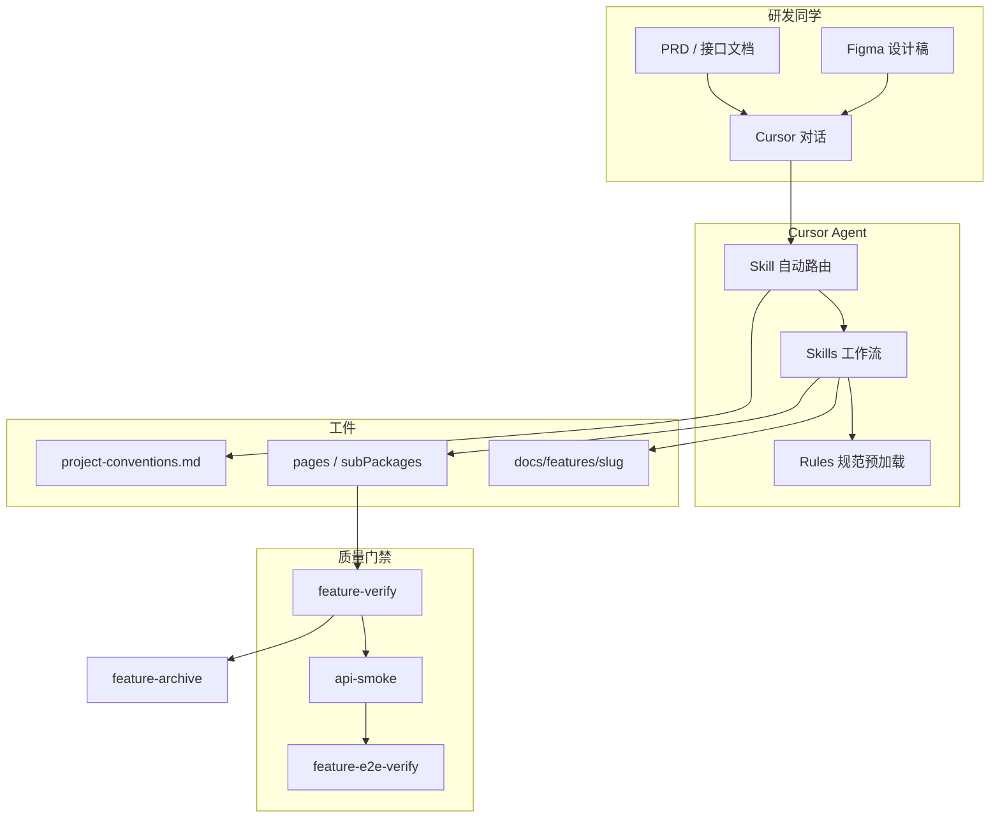
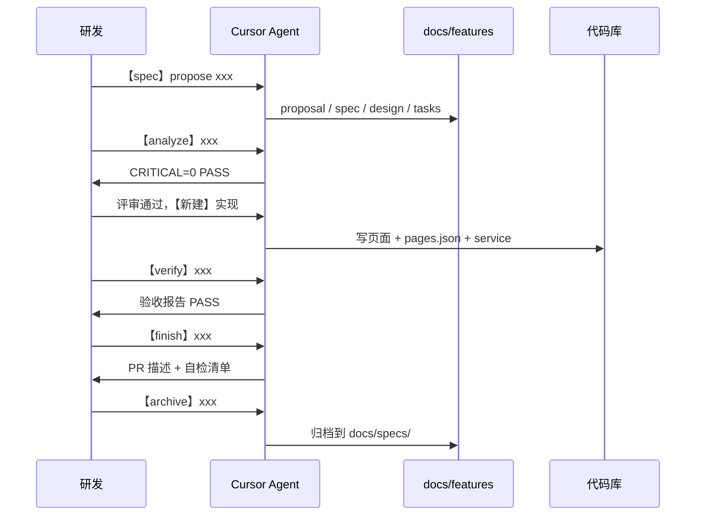

# uni-app 移动端 Cursor Agent 工作流 — 培训分享文档

> 适用对象：前端开发、技术负责人、使用 Cursor 进行 uni-app 研发的团队成员  
> 版本：Bundle 1.3.3 · 更新日期：2026-07-10  
> **权威仓：** [fe-agent-workflow](../../README.md) · `uniapp/` 目录 · 安装：`../../tools/install.sh uniapp <项目路径>`  
> **统一仓培训：** [../../docs/agent-workflow-repo-guide.md](../../docs/agent-workflow-repo-guide.md)

---

## 〇、权威仓与业务项目（必读）

| | 权威源 | 业务项目（本仓库） |
|--|--------|-------------------|
| 路径 | `fe-agent-workflow/uniapp/` | `HiStore-mall-mobile/` |
| `.cursor/` | 在这里改 rules/skills | **install 安装产物**，勿当源头合码 |
| `project-conventions.md` | 不存放 | bootstrap 扫描生成，install **会保留** |
| 进行中 feature | 模板在权威仓 | `docs/features/<slug>/` 留在业务仓 |

```bash
# 方式 A：本地已 clone fe-agent-workflow
./tools/install.sh uniapp /path/to/HiStore-mall-mobile
./tools/install.sh uniapp /path/to/HiStore-mall-mobile --with-docs   # 可选：同步 SDD 模板

# 方式 B：直接从 Git 安装（无需本地 clone 工作流仓）
bash tools/install.sh uniapp /path/to/HiStore-mall-mobile \
  --from-git https://github.com/TieZhuzhu/fe-agent-workflow.git \
  --with-docs

# 或一键远程安装：
curl -fsSL https://raw.githubusercontent.com/TieZhuzhu/fe-agent-workflow/master/tools/remote-install.sh \
  | bash -s -- uniapp /path/to/HiStore-mall-mobile --with-docs
```

内核级变更（SDD、analyze、skill-creator 等）须在 `pc` ↔ `uniapp` 间同步，见 [agent-kernel-sync.md](./agent-kernel-sync.md)。

---

## 一、这套体系是什么？

这是一套为 **uni-app 移动端项目**（H5 / 微信小程序 / App）定制的 **AI 辅助编码操作系统**，不是几条零散的 Prompt，而是四层协作：

| 层级 | 位置 | 作用 |
|------|------|------|
| **宪法** | `docs/constitution.md` | 不可违反的原则（分包、接口透传、禁止 mock 等） |
| **规范 Rules** | `.cursor/rules/*.mdc` | 怎么写代码（Vue2/3、分包、样式、接口） |
| **流程 Skills** | `.cursor/skills/*/SKILL.md` | 怎么做一件事（新建页、联调、验收、修 bug） |
| **规格 SDD** | `docs/features/<slug>/` | 先写清楚再写码（可评审、可跨会话） |
| **项目约定** | `.cursor/project-conventions.md` | 扫描当前仓库事实（request 路径、接口组织方式） |

**一句话：** 人负责需求和验收，Agent 按规范 + 流程生成代码；规格文档是人和 AI 的「合同」。

---

## 二、整体架构



### 权威来源优先级（冲突时按此裁决）

```
docs/constitution.md（原则）
  → .cursor/rules/*.mdc（写法）
  → .cursor/skills（流程）
  → docs/features/<slug>/（本需求规格）
  → .cursor/project-conventions.md（项目扫描事实）
```

---

## 三、核心能力一览

### 3.1 规范能力（Rules，11 个）

| 规范 | 解决什么问题 |
|------|--------------|
| 前端通用代码规范 | 总则、Vue 版本判定、Skill 路由 |
| uniapp 代码生成指南 | 页面类型、生命周期、导航、列表/表单 |
| 路由与分包规范 | **非 tabBar 不进主包**、子包按模块划分 |
| 项目结构与命名规范 | 目录、接口组织（页面级 vs 集中式） |
| Vue / Vue2 代码生成指南 | Composition API vs Options API |
| 接口对接规范 | 入参透传、出参直绑、禁止猜字段 |
| HTML/CSS/JS/TS 指南 | rpx、样式、types 职责 |
| 代码规范示例参考 | 可复制示例（仅查阅，非预加载） |

### 3.2 流程能力（Skills，31 个）

按场景分类：

#### 接入与约定

| Skill | 能做什么 |
|-------|----------|
| `project-bootstrap` | 扫描项目，生成 `project-conventions.md` |
| `skill-creator` | 新建/修改/优化团队 Skill（manifest、触发词） |

#### 需求输入（多源）

| Skill | 能做什么 |
|-------|----------|
| `feature-spec` | 创建 SDD 规格目录 |
| `feature-analyze` | implement 前 artifact 一致性门禁（`feature-check analyze`） |
| `feature-finish` | verify PASS 后 PR 描述与合码自检 |
| `prd-markdown-ingest` | 语雀/飞书 Markdown 清洗 |
| `prd-feature-dev` | PRD + 截图 → 需求摘要 |
| `figma-feature-dev` | Figma MCP 切图（**内容区百分百还原**） |
| `prototype-html-feature-dev` | HTML / Axure 原型转页面 |
| `spec-analyze-ui-images` | UI 截图结构化分析 |
| `spec-research-clarify` | 复杂需求澄清 |

#### 开发与实现

| Skill | 能做什么 |
|-------|----------|
| `feature-dev-workflow` | **主工作流**：理解 → 对齐 → 写码 → 验收 |
| `vue-page-codegen` | 生成列表/表单/详情/弹层页 |
| `incremental-feature` | 已有页加字段、按钮、筛选项（最小 diff） |
| `route-permission` | 注册 `pages.json`、主包/分包判定 |
| `api-integration` | 手写接口联调 |
| `openapi-api-integration` | OpenAPI 自动生成 types + services |
| `shared-component` | 跨子包公共组件封装 |

#### 质量与验收

| Skill | 能做什么 |
|-------|----------|
| `feature-verify` | L1：对照 spec + lint/build |
| `api-smoke` | L2：curl 接口探针 |
| `feature-e2e-verify` | L3：H5/浏览器 UI 冒烟 |
| `code-review` | 规范审查（只评不改） |
| `lint-check` | ESLint 修复 |
| `unit-test-codegen` | 单测生成 |
| `ci-fix` | 编译/build 失败修复 |

#### 维护与重构

| Skill | 能做什么 |
|-------|----------|
| `bugfix-workflow` | 四阶段 Bug 排查修复（复现→假设→验证→修复） |
| `page-refactor` | 大文件拆分 |
| `code-normalize` | 单页/单模块规范整理 |
| `rules-refactor` | 全项目规范重构闭环 |
| `vue2-to-vue3-refactor` | Vue2 → Vue3 迁移 |

#### 归档

| Skill | 能做什么 |
|-------|----------|
| `feature-archive` | 验收通过后合并 spec 到主库 |

---

## 四、Agent 能做什么？（按研发场景）

| 场景 | 能力评估 | 推荐路径 |
|------|----------|----------|
| 新建标准列表/详情/表单页 | ⭐⭐⭐⭐⭐ | spec → analyze → 新建 → verify → finish |
| 从 PRD + 接口文档开发 | ⭐⭐⭐⭐⭐ | spec → prd-feature-dev |
| 从 Figma 切图（移动端） | ⭐⭐⭐⭐ | figma-feature-dev（内容区 rpx 还原） |
| 已有页加筛选/加按钮 | ⭐⭐⭐⭐⭐ | 增量 |
| 接口联调、字段对齐 | ⭐⭐⭐⭐⭐ | 联调 / OpenAPI |
| 注册分包路由 | ⭐⭐⭐⭐⭐ | 路由 |
| 修 bug、排查报错 | ⭐⭐⭐⭐ | bug |
| 单页规范整理 | ⭐⭐⭐⭐ | 优化 |
| 复杂交互/动画页 | ⭐⭐⭐ | 需人主导拆分 |
| 微信支付/订阅消息等 | ⭐⭐ | 需人补充平台知识 |
| 小程序真机 E2E | ⭐⭐ | L3 偏 H5，真机需人工 |

---

## 五、标准工作流（SDD + 四阶段）

### 5.1 完整生命周期



### 5.2 开发主流程四阶段

`feature-dev-workflow` 内部：

```
⓪ feature-spec（新建且非 trivial）
    ↓
⓪b feature-analyze（ready 门禁，feature-check analyze PASS）
    ↓
① 理解需求（页面类型、子包、接口、交互）
    ↓
② 方案对齐（design.md、文件清单、pages.json path）
    ↓
③ 生成代码（vue-page-codegen + route-permission）
    ↓
④ 规范验收（reference-checklist + feature-verify）
```

### 5.3 验收三层模型

| 层级 | Skill | 验证什么 | 何时用 |
|------|-------|----------|--------|
| **L1** | `feature-verify` | spec 是否实现、能否编译、lint | **必做** |
| **L2** | `api-smoke` | 真实接口 JSON 结构 | 联调后可选 |
| **L3** | `feature-e2e-verify` | 浏览器可点、主流程通 | 大改/上线前可选 |

---

## 六、怎么使用？（黄金话术）

> **技巧：** 首句带 **场景词**（spec / 新建 / 增量 / 联调 / verify / bug / 路由），Agent 会自动路由到对应 Skill。

### 6.1 首次接入项目（每个仓库做一次）

```
扫描项目约定，生成 project-conventions.md
```

产出：`.cursor/project-conventions.md`（request 路径、接口组织、tabBar、子包列表等）

### 6.2 新建功能（推荐完整路径）

**Step 1 — 写规格**

```
【spec】propose coupon-list。
优惠券列表页，子包 subPackages/coupon，从个人中心进入。
页面类型：列表页。附：接口文档 / PRD
```

**Step 1b — 规划门禁**

```
【analyze】coupon-list
```

须 `feature-check analyze` **PASS**（CRITICAL=0）后方可写码。

**Step 2 — 实现**

```
【新建】按 docs/features/coupon-list/ 实现优惠券列表页
```

**Step 3 — 验收与收尾**

```
【verify】coupon-list
【finish】coupon-list
【archive】coupon-list
```

### 6.3 快捷路径（小需求可跳过 spec）

```
【新建】按 PRD 开发优惠券列表。子包 coupon，列表页。附接口文档
```

> 简单单文件增量、修 bug 可省略 spec，但 Agent 交付时应说明「已跳过 spec」。

### 6.4 常见场景话术表

| 你想做的事 | 复制即用 |
|------------|----------|
| 语雀 PRD | `【spec】propose xxx。语雀 PRD 如下：（粘贴 Markdown）` |
| Figma 切图 | `【新建】按 Figma 切商品详情页。链接：https://figma.com/design/... 附接口` |
| 增量改页 | `【增量】在 subPackages/order/list 加「待评价」Tab` |
| 联调接口 | `【联调】按 OpenAPI 对接 order/list，spec：docs/openapi/order.yaml` |
| 注册路由 | `【路由】新建积分明细，子包 user，path integral-log` |
| 修 Bug | `【bug】订单列表下拉刷新后数据重复，帮我排查` |
| 规范整理 | `【优化】按规范整理 subPackages/product/list` |
| Code Review | `【review】检查 subPackages/order/detail 是否符合规范` |
| Lint | `【lint】跑 eslint，修未使用引入` |
| CI 挂了 | `【ci】编译失败，帮我修到通过` |

---

### 6.8 CLI 工具箱（Agent 优先使用）

| 命令 | 用途 |
|------|------|
| `python3 .cursor/skills/scripts/feature-check.py analyze <slug>` | ready 前 artifact 一致性 |
| `python3 .cursor/skills/scripts/feature-check.py verify <slug>` | L1 验收门禁 |
| `python3 .cursor/skills/scripts/feature-check.py board` | 进行中 feature 看板 |
| `python3 .cursor/skills/scripts/spec-index.py` | 刷新 pages.json ↔ spec 索引 |

详见 `.cursor/skills/shared/project-toolbox.md`。

---

## 七、关键规范（培训必讲）

### 7.1 分包规则（移动端核心）

| 规则 | 说明 |
|------|------|
| 主包 `pages` | **仅** tabBar 页 + 极少启动必要页 |
| 业务页 | **必须** `subPackages` |
| 子包划分 | 按功能模块：product、order、user、coupon… |
| 复用子包 | 优先追加到已有子包，单页不随意新建子包 |

### 7.2 接口对接

- **入参原样透传**，禁止 `|| ''` 兜底
- **出参原样绑定**，禁止 `normalizeRows` 猜字段
- 字段 prop 以**接口文档**为准，设计稿 label 只作展示文案

### 7.3 UI 策略

- **原生组件优先**，uview 补充
- Vue 2 / Vue 3 按项目判定，**禁止混用**

### 7.4 Figma 切图策略（移动端特有）

| 范围 | 要求 |
|------|------|
| **页面内容区** | 间距、字号、颜色、圆角等 **rpx 百分百还原** |
| **系统 chrome** | 状态栏、微信胶囊、底部 Home 条 **不写入代码** |
| **业务顶栏/底栏** | 导航内容与固定操作栏与稿一致 |

### 7.5 质量红灯（Agent 交付自检）

出现任一项视为流程失败：

- 非 tabBar 页放入主包
- Vue2/3 混用
- 无「规范预加载」汇报
- 新建页无 spec 且未声明跳过
- 未注册 `pages.json`
- 使用 mock 数据（未经用户允许）

---

## 八、目录地图（培训师速查）

```
项目根/
├── .cursor/
│   ├── rules/                    # 编码规范（Agent 写码前 Read）
│   ├── skills/                   # 工作流 Skill（28 个）
│   │   ├── README.md             # Skill 索引 + 黄金话术
│   │   └── shared/
│   │       └── rules-activation.md  # 预加载门禁
│   └── project-conventions.md    # bootstrap 扫描产出
├── docs/
│   ├── constitution.md           # 项目宪法
│   ├── features/                 # 进行中 feature 规格
│   │   ├── _template/            # 规格模板
│   │   └── README.md
│   ├── specs/                    # 已归档 spec 主库
│   └── testing/README.md         # L1/L2/L3 验收说明
├── pages/                        # 主包（tabBar）
├── subPackages/                  # 分包（业务页）
└── service/ 或 页面 services.*   # 接口（因项目而异）
```

---

## 九、培训演示建议（90 分钟议程）

| 时间 | 环节 | 内容 |
|------|------|------|
| 10 min | 背景 | 为什么需要 Rules + Skills + SDD，与中后台差异 |
| 15 min | 架构 | 第四节架构图、权威来源、bootstrap |
| 15 min | 规范 | 分包、接口、Figma 还原策略 |
| 20 min | **Live Demo 1** | `【spec】propose` → `【新建】` → 看 Agent 产出 |
| 15 min | **Live Demo 2** | `【增量】` 或 `【联调】` |
| 10 min | 验收 | verify / api-smoke / 质量红灯 |
| 15 min | Q&A | 局限、何时不用 Agent、最佳实践 |

### 演示前准备 checklist

- [ ] 项目已执行 bootstrap，`project-conventions.md` 存在
- [ ] 准备好 PRD 片段 + 接口文档（或 OpenAPI URL）
- [ ] Figma 演示需配置 Figma MCP
- [ ] 准备一个 trivial 增量场景备用（演示快）

---

## 十、最佳实践

### 10.1 给 Agent 的好输入

| 好的输入 | 差的输入 |
|----------|----------|
| 「子包 product，列表页，附接口文档」 | 「帮我做个页面」 |
| 「在 subPackages/order/list 加状态筛选，字段 status」 | 「改一下订单页」 |
| Figma 链接 + node-id + 接口文档 | 只有一张截图无说明 |
| `【spec】propose` 再 `【新建】` | 直接让写码无规格 |

### 10.2 人的职责边界

| 人负责 | Agent 负责 |
|--------|------------|
| 需求范围、业务规则确认 | 按 spec 生成代码骨架 |
| 接口文档准确性 | services 对接、field-map |
| 设计稿内容区验收 | rpx 样式还原 |
| 小程序真机/支付/审核 | 标准页面逻辑实现 |
| verify PASS 签字 | lint/build 自检 |

### 10.3 何时省略 SDD

| 可省略 spec | 建议必须 spec |
|-------------|---------------|
| 单文件加一列 | 新建整页 |
| 修 bug | 多接口、多文件 |
| 单行样式微调 | 复杂 Tab / 多区块页 |
| | Figma 切图新页 |

---

## 十一、当前局限（诚实告知团队）

1. **小程序深度能力**（支付、订阅消息、审核）无专项 Skill，需人补充
2. **L3 E2E** 偏 H5 浏览器，微信开发者工具/真机需人工
3. **强依赖 MCP** 时（Figma、Browser），环境不可用则质量降级
4. **复杂动画/拖拽** 无专门规范，需人拆分方案
5. **性能专项**（分包预下载、setData 优化）仅有基础分包规则

---

## 十二、延伸阅读（团队自学）

| 文档 | 路径 |
|------|------|
| Skill 索引与话术 | `.cursor/skills/README.md` |
| 预加载门禁 | `.cursor/skills/shared/rules-activation.md` |
| 项目宪法 | `docs/constitution.md` |
| Feature 生命周期 | `docs/features/README.md` |
| 验收分层 | `docs/testing/README.md` |
| Figma 切图细则 | `.cursor/skills/figma-feature-dev/SKILL.md` |
| 代码示例 | `.cursor/rules/代码规范示例参考.mdc` |

---

## 附录 A：Skill 与场景词对照（可打印）

```
spec / propose     → 写规格
analyze            → feature-analyze（ready 门禁）
新建 / PRD / Figma → feature-dev-workflow
增量 / 加字段      → incremental-feature
联调 / Swagger     → api-integration / openapi-api-integration
路由 / pages.json  → route-permission
bug / 报错         → bugfix-workflow
优化 / 规范化      → code-normalize
review             → code-review
verify             → feature-verify
finish             → feature-finish（PR 收尾）
api-smoke          → api-smoke
verify-e2e         → feature-e2e-verify
archive            → feature-archive
bootstrap / 扫描   → project-bootstrap
skill-creator      → 新建/修改 Skill
lint               → lint-check
ci / build 失败    → ci-fix
```

---

## 附录 B：一页纸速查（分享结尾用）

```
┌─────────────────────────────────────────────────────────┐
│  uni-app Cursor Agent 工作流 — 一页速查                  │
├─────────────────────────────────────────────────────────┤
│  权威仓：fe-agent-workflow/uniapp → install.sh 装进业务项目 │
│  首次：扫描项目约定，生成 project-conventions.md（业务仓）   │
│  新建：【spec】→ 【analyze】→ 【新建】→ 【verify】→ 【finish】→ archive │
│  增量：【增量】在 xxx 页面加 yyy                         │
│  联调：【联调】+ 接口文档/OpenAPI                        │
│  切图：Figma 链接 + 接口；内容区百分百，系统栏不画       │
│  分包：非 tabBar 必须 subPackages                      │
│  接口：入参透传、出参直绑、禁止 mock                     │
│  验收：L1 必做，L2/L3 按需                               │
└─────────────────────────────────────────────────────────┘
```

---

*本文档随 `.cursor/skills` Bundle 版本演进；规范变更以 `.cursor/skills/CHANGELOG.md` 为准。权威仓说明见 [../../docs/agent-workflow-repo-guide.md](../../docs/agent-workflow-repo-guide.md)。*
